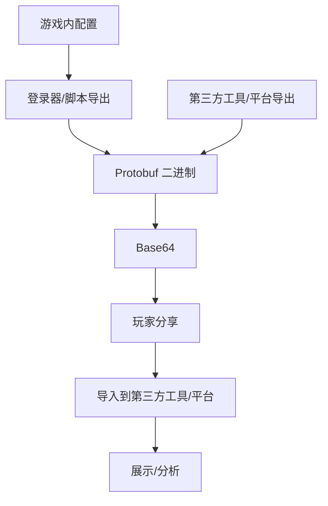

# 赛尔精灵码 PetCode

> 为赛尔号精灵配置建立统一的数据交换协议标准

本项目旨在为赛尔号精灵的配置数据建立统一的交换协议标准，使精灵配置能够以标准化格式存储与传递，方便玩家便捷地分享自己的配置，也方便第三方工具间的数据互通与集成。

## 💡 动机

### 玩家的困扰

在过去，玩家们分享精灵配置的方式主要通过截图或录屏，这种方式不仅操作繁琐，而且无法序列化，也自然无法导入到其他工具（如精灵配置计算器）中。

### 开发者的困境

开发者们也面临相同的难题，例如想要开发一个配置分享平台，配置的投稿/展示功能只能通过以下方式实现：

- **存放配置截图** - 存储/带宽消耗大，且无法进行其他分析
- **接收截图投稿并手动解析配置** - 费时费力，且容易出错
- **通过内置配置计算器实现序列化数据投稿** - 用户需要手动输入配置

这对于玩家和开发者都是不友好的，且缺乏通用性。

## 🎯 目标

本项目的目标是建立一个标准的精灵配置数据交换协议，通过该协议：

- **登录器/脚本开发者** - 可基于该协议实现游戏内玩家或 BOSS 的精灵配置一键导出
- **图鉴/计算器/网站开发者** - 可通过该协议实现精灵配置的导入/导出，并通过图片或网页展示，亦或是使用序列化数据进行验证/存储
- **玩家** - 可使用上述工具提供的配置代码/图片在社区分享精灵配置，或使用各种工具，无需考虑任何问题，**一码通万途**

## 🏗️ 设计

本项目基于 `Protocol Buffers`（以下简称 Protobuf）作为数据交换格式，主要有以下几点考量：

### 什么是 Protobuf？

Protobuf 是 Google 开发的一种语言中立、平台中立的数据序列化格式。简单来说，它就像 JSON 或 XML，但更小、更快、更简单。

只需要在 `.proto` 文件中定义一次数据结构，就可以使用自动生成的代码在各种语言中轻松读写这些结构化数据。最终序列化后的数据是高度压缩的二进制格式，特别适合网络传输和存储。

### 为什么选择 Protobuf？

1. **跨语言支持** - Protobuf 支持多种编程语言（Python、TypeScript、Java、Go 等），让不同技术栈的开发者都能轻松集成
2. **高效编码** - 相比 JSON/XML，Protobuf 采用二进制编码，数据更加紧凑，非常适合生成短代码进行分享
3. **强类型定义** - Proto 文件提供了明确的数据结构定义，既是代码生成的基础，也是天然的接口文档
4. **向后兼容** - Protobuf 的字段编号机制支持协议的渐进式演进，可以在不破坏现有工具的前提下扩展新功能
5. **成熟稳定** - 作为 Google 开源的成熟技术，拥有完善的生态系统和工具链

### 数据流转示例

## 🔌 接入条件

详见 [使用手册 - 接入条件](./docs/manual.md#9-接入规范)

## 📖 使用文档

- [使用手册](./docs/manual.md) - 包含安装、快速开始、API详解等完整指南
- [SDK 开发指南](./docs/sdk-development.md) - 包含如何开发 SDK 的详细说明
- [数据结构文档](./docs/data-structure.md)

## 贡献

欢迎提交 Issue 和 Pull Request！

## 许可证

详见 [LICENSE](./LICENSE) 文件
